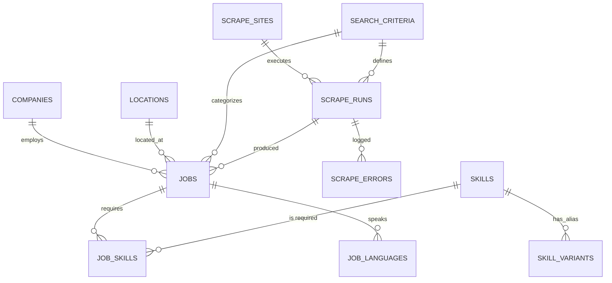

# Stage 1 Database Schema Design

This document details the database architecture for **EasyHire Scout**, explaining the structural design, normalization choices, and the rationale behind specific implementation details based on the **Stage 1 Architectural Decisions**.

---

## 1. Core Philosophy & Design Goals

The EasyHire Scout database is built on three pillars of engineering excellence:
1.  **3NF Normalization**: All core business entities (Jobs, Companies, Skills) are strictly normalized to ensure data integrity and prevent update anomalies.
2.  **Search Performance**: Native PostgreSQL Full-Text Search (FTS) is integrated directly into the schema with GIN indexes, replacing slow `LIKE` queries.
3.  **Deterministic Tracking**: The schema is designed to track scraping history, errors, and "freshness" with surgical precision to support automated data lifecycle management.

---

## 2. Entity-Relationship Breakdown

### 2.1 Core Business Entities
*   **`Company`**: Centralized repository for employer data. Includes `normalized_name` for deduplication and FTS indexes on `name`.
*   **`Location`**: A normalized table for geographic data, supporting both physical coordinates (Lat/Long) and remote flags. Unique constraints on (City, Country, Region) prevent duplicate entries.
*   **`JobCategory`**: Broad classification for job roles (e.g., "Software Engineering", "Data Science").

### 2.2 Scraping Infrastructure
*   **`ScrapeSite`**: Registry of supported scraping sources (e.g., LinkedIn, Indeed).
*   **`SearchCriteria`**: Represents a unique "Search Intent" or **Cohort**. 
    *   **Decision 7 (Canonical Hashing)**: Uses a `cohort_hash` (SHA-256) generated from a deterministic pipeline to prevent duplicate scraping runs for identical intents.
    *   **Decision 8 (JSONB Config)**: Violates 3NF by storing `parameters` as JSONB. This keeps the API lightning-fast as it acts as an immutable intent log rather than an analytical target.
*   **`ScrapeRun`**: Tracks individual execution instances. Linked to both a site and a criteria cohort. Used for frontend status polling (**Decision 1**).
*   **`ScrapeError`**: Granular tracking of failures, including URL and error type, to facilitate debugging of flakiness.

### 2.3 The Core Data Asset: `Job`
The `Job` table is the heart of the system. It links companies, locations, and scraping metadata.
*   **Decision 2 & 6 (Freshness Invariant)**: Includes `last_seen_at`. A job is only marked `is_active=False` if its `last_seen_at` hasn't moved across two successful runs within its specific `SearchCriteria` cohort.
*   **Decision 3 (Search Strategy)**: Optimized FTS indexes on `title` and `description` (concatenated with requirements) using the `english` dictionary.
*   **Decision 5 (Language Strictness)**: Fields like `requires_german` and the `JobLanguage` junction table support the double-headed language extraction logic.

### 2.4 The Skills System
*   **`Skill`**: Canonical skill names (e.g., "JavaScript"). Includes GIN index for search.
*   **`SkillVariant`**: Maps aliases (e.g., "JS", "ES6") to a canonical ID (**Decision 4**). This allows the LLM to return raw strings which are then mapped to high-value structured data.
*   **`JobSkill`**: Junction table with a `weight` field to differentiate between "Must-have" and "Nice-to-have" skills.

---

## 3. Detailed Architectural Rationales

### 3.1 Why PostgreSQL FTS over `LIKE`?
*(Based on Decision 3)*
`LIKE/ILIKE` queries are $O(N)$ and perform poorly on large text blocks. By using `tsvector` and GIN indexes, we achieve sub-millisecond search performance across thousands of job descriptions. The use of `ts_rank` allows us to sort results by linguistic relevance, providing a premium "Search" experience.

### 3.2 Why JSONB in `SearchCriteria`?
*(Based on Decision 8)*
While strict 3NF would suggest a junction table for search filters, doing so would force the API to perform complex entity resolution (e.g., mapping a user's raw skill string to a DB ID) *synchronously*. By storing the raw intent in JSONB, the API remains highly responsive, and the heavy lifting of normalization is offloaded to the background Celery worker.

### 3.3 Why `last_seen_at` instead of `updated_at`?
*(Based on Decision 6)*
`updated_at` changes whenever any field is modified. `last_seen_at` is a dedicated "heartbeat" for the job listing. If a scraper sees a job but nothing has changed, only `last_seen_at` is bumped. This "Freshness Invariant" is the foundation of our **Success-Triggered Differential Inactivation** strategy, preventing accidental deletion of jobs during partial scraper failures.

### 3.4 Why Skill Canonicalization?
*(Based on Decision 4)*
LLMs often produce inconsistent skill names. Without the `SkillVariant` system, "React.js" and "React" would be treated as different entities, fragmenting the search results. Our two-tier system (Canonical + Variant) turns noisy LLM output into a clean, queryable knowledge graph.

---

## 4. Schema Visual Overview

## 5. Security & Constraints
-   **Cascades**: `ON DELETE CASCADE` is used for junction tables (e.g., `JobSkill`) to ensure clean deletions.
-   **Deduplication**: `source_url` on `Job` and `name` on `Company` are unique to prevent data pollution.
-   **Data Integrity**: Foreign keys are enforced across all relationships, maintaining a strict 3NF hierarchy outside of the intentional configuration boundary.
